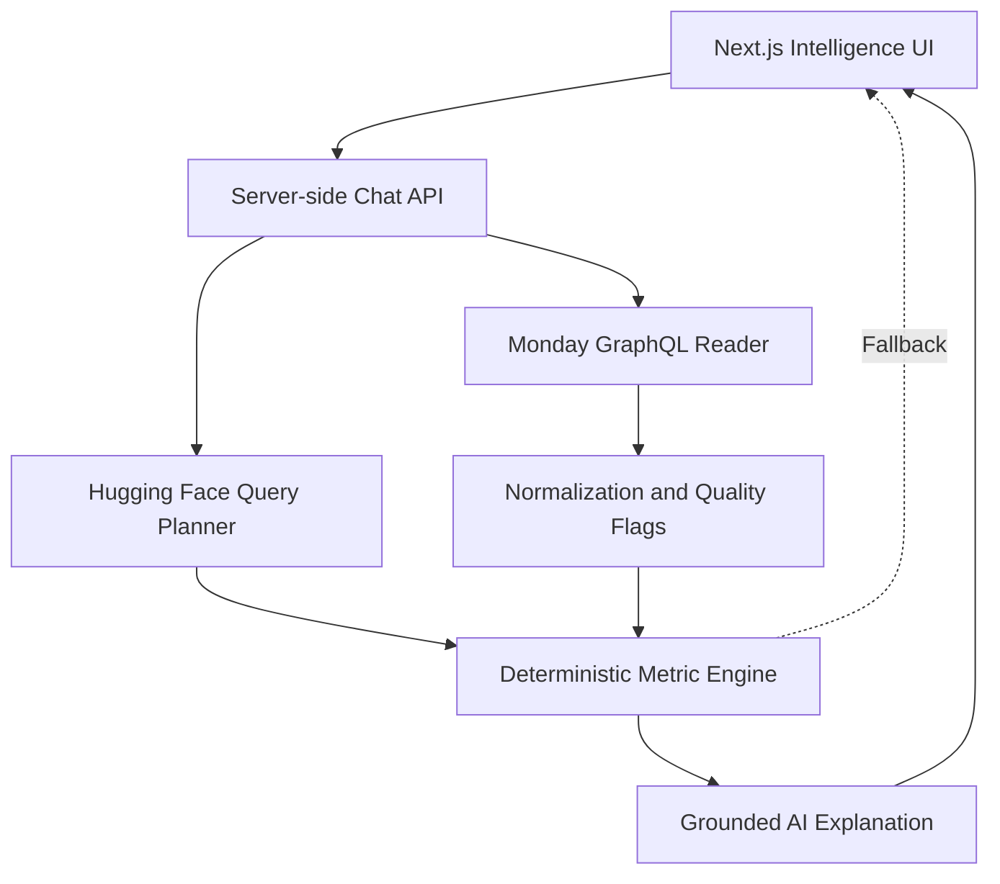

# Skylark Intelligence

A hosted, read-only conversational business intelligence agent for answering founder-level questions using live Monday.com data.

Skylark Intelligence handles inconsistent records through explicit normalization, calculates authoritative metrics deterministically, and uses a Hugging Face-hosted language model to interpret questions and explain results.

## Links

- **Live application:** [https://skylark-bi-one.vercel.app/](https://skylark-bi-one.vercel.app/)
- **Source code:** [https://github.com/madhurmaru/Skylark-BI](https://github.com/madhurmaru/Skylark-BI)
- **Health check:** [https://skylark-bi-one.vercel.app/api/status](https://skylark-bi-one.vercel.app/api/status)

## Features

### Assignment mode

The default deployment is configured for the supplied **Deals** and **Work Orders** boards.

It can:

- Answer pipeline, sector, revenue, collection and operational questions.
- Combine Deals and Work Orders when cross-board context is required.
- Interpret relative periods such as “this quarter” as exact dates.
- Treat “energy” as Powerline and Renewables while disclosing that interpretation.
- Calculate weighted pipeline, overdue pipeline, collection ratios and schedule risk.
- Produce concise leadership updates with KPIs, risks and suggested actions.
- Flag missing values, probabilities and dates, negative billing and incomplete receivables.
- Show board-level row lineage and data-quality caveats.
- Continue providing deterministic answers if model inference fails.

### Analyze your own Monday boards

Visitors can temporarily connect between one and ten arbitrary Monday boards.

The application:

- Accepts numeric board IDs or Monday board URLs.
- Automatically discovers each board’s name, columns, types and available values.
- Does not require boards to be classified as Deals, Work Orders, Sales or Projects.
- Infers semantic roles such as status, date, amount, percentage, owner, customer and category.
- Calculates deterministic summaries where the inferred schema supports them.
- Supports comparisons across multiple connected boards.
- Reports uncertain mappings, missing data and data-coverage limitations.
- Clears temporary credentials and board selections when the page is refreshed.

## Architecture



The language model does not calculate authoritative totals.

In assignment mode, it produces a typed query plan and explains facts supplied by the specialized Deals and Work Orders analytics engine. In arbitrary-board mode, the application first discovers and normalizes the available schema before selecting compatible deterministic analyses.

The default deployment uses server-side Vercel environment variables. Temporary Monday credentials are accepted per request only after an explicit connection test and remain in browser memory for the current tab.

## Technology stack

- Next.js 15
- React 19
- TypeScript
- Monday.com GraphQL API
- Hugging Face Inference Providers
- `openai/gpt-oss-120b:cheapest`
- Zod request validation
- Vitest
- Vercel
- Code-native design system with light, dark and system themes

## Product interface

Skylark Intelligence is designed as an executive intelligence workspace rather than a generic chat application.

The interface includes:

- Responsive desktop and mobile navigation.
- Premium conversational intelligence workspace.
- Suggested founder-level questions.
- Structured executive responses.
- Connected-board status and provenance.
- Temporary-board management.
- Accessible dialogs, inputs and feedback states.
- Loading, empty, success and failure states.
- Light, dark and system themes.

### Themes

- **Light:** warm neutral background, elevated white surfaces and deep navy text.
- **Dark:** deep navy-black background, layered charcoal surfaces and restrained blue/teal accents.
- **System:** follows the device’s `prefers-color-scheme` setting.

Only the non-sensitive theme preference is stored in `localStorage` under `skylark-theme`.

Monday credentials, board selections, chat messages and business data are never stored in browser storage.

## Local setup

### Requirements

- Node.js 20 or later
- npm
- A Monday.com personal API token
- A Hugging Face fine-grained access token

### Installation

```bash
git clone https://github.com/madhurmaru/Skylark-BI.git
cd Skylark-BI
npm install
cp .env.example .env.local
npm run dev
```

Open [http://localhost:3000](http://localhost:3000).

Never commit `.env.local` or expose its values in client-side code.

## Environment variables

```env
MONDAY_API_TOKEN=
MONDAY_DEALS_BOARD_ID=
MONDAY_WORK_ORDERS_BOARD_ID=
HF_TOKEN=
```

| Variable | Purpose |
|---|---|
| `MONDAY_API_TOKEN` | Server-side personal token used for read-only Monday API requests |
| `MONDAY_DEALS_BOARD_ID` | Default Deals board ID |
| `MONDAY_WORK_ORDERS_BOARD_ID` | Default Work Orders board ID |
| `HF_TOKEN` | Hugging Face token used for model inference |

Follow [`docs/MONDAY_SETUP.md`](docs/MONDAY_SETUP.md) for board import, column configuration, token creation and deployment instructions.

## Temporary arbitrary-board mode

The **Try your own boards** flow accepts:

- A Monday personal API token.
- Between one and ten board IDs or Monday board URLs.

For a URL such as:

```text
https://example.monday.com/boards/1234567890
```

the application extracts:

```text
1234567890
```

Before activation, the server performs a read-only connection test and confirms access to every board. It returns only safe metadata such as the board name, ID, item count and detected columns.

Temporary configuration:

- Remains only in React memory.
- Is cleared when the page refreshes.
- Does not modify Vercel environment variables.
- Is not written to `localStorage`, `sessionStorage`, IndexedDB, cookies or URLs.
- Is not included in chat history, analytics or telemetry.
- Is never forwarded to Hugging Face.
- Never exposes the deployment owner’s Monday token.

Monday personal tokens inherit the user’s existing Monday permissions. A production multi-user implementation should use Monday OAuth with scoped app permissions.

## Data normalization

The application handles:

- Missing and null values.
- Inconsistent capitalization and whitespace.
- Multiple date representations.
- Currency symbols and comma-formatted numbers.
- Percentages and probability labels.
- Status and dropdown values.
- Negative or incomplete financial values.
- Renamed or partially matching columns.
- Arbitrary-board schema inference.

Original source values and board provenance are retained wherever possible. Uncertain semantic mappings are disclosed instead of being treated as confirmed.

## Deterministic analytics

### Active pipeline

Open and On Hold deals matching the selected sector and date scope.

### Weighted pipeline

```text
Deal value × closure weight
```

Default weights:

| Probability | Weight |
|---|---:|
| High | 75% |
| Medium | 50% |
| Low | 25% |
| Missing | 30% |

Missing probabilities are explicitly flagged.

### Overdue pipeline

An active deal whose tentative close date is earlier than the analysis date.

### Schedule risk

A work order whose probable end date is earlier than the analysis date and whose execution status is not completed.

### Billed ratio

```text
Recorded amount to be billed ÷ recorded total order value
```

### Collection ratio

```text
Collected ÷ (Collected + Receivable)
```

Only recorded values are included in these calculations.

## Clarifying questions

The agent asks for clarification when a query:

- Uses an ambiguous metric such as “performance” or “value”.
- Does not identify a relevant timeframe.
- Could refer to multiple compatible columns.
- Depends on an unfamiliar or conflicting inferred schema.
- Cannot be answered reliably from the connected data.

This is an accuracy-first choice. Responding immediately under material uncertainty could produce misleading calculations or unsupported conclusions.

The current prototype may occasionally ask more questions than necessary, particularly in arbitrary-board mode. A future version would use confidence thresholds to proceed with clearly disclosed assumptions, combine multiple uncertainties into one concise clarification and provide a preliminary answer whenever possible.

## Leadership updates

“Leadership updates” are interpreted as concise executive briefings rather than raw-data exports.

A leadership-ready answer prioritizes:

- Headline KPIs.
- Material changes.
- Pipeline or operational risks.
- Data-quality caveats.
- Opportunities.
- Suggested actions.
- Recommended follow-up questions.
- Source-board provenance.

The output is designed to be reusable in weekly founder or leadership reviews without presenting unsupported claims as facts.

## Chat history and privacy

Chat history is intentionally session-scoped.

- Messages remain visible during the current page session.
- Refreshing the page clears the conversation.
- Chats are not written to a database.
- Business questions are not persisted.
- Connected board data is not cached in browser storage.
- Temporary credentials disappear on refresh.

This minimizes unnecessary retention of sensitive business information. A production version could add authenticated, encrypted and user-controlled conversation history with retention and deletion settings.

## Failure handling

- Monday and Hugging Face failures return actionable, sanitized messages.
- Authorization headers and tokens never appear in API responses.
- Monday operations remain read-only.
- Workbook data is not bundled or hardcoded into the application.
- Source data is fetched dynamically.
- Only normalized business facts and the user’s question are sent to Hugging Face.
- Deterministic fallback preserves core BI functionality if inference is unavailable or credits are exhausted.
- Large-board safeguards limit data retrieval and disclose truncation or coverage limitations.

## Validation

```bash
npm test
npm run lint
npm run build
```

## Suggested acceptance prompts

### Assignment boards

1. How is our energy sector pipeline looking this quarter?
2. What is our weighted pipeline for mining, and how complete is the data?
3. Where is receivables risk concentrated?
4. How many work orders are overdue and not completed?
5. Prepare a concise leadership update.

### Arbitrary boards

1. Summarize the connected boards and identify the most important issues.
2. What percentage of items are completed, in progress and blocked?
3. Which deadlines are overdue or approaching?
4. Compare performance across the connected boards.
5. What data-quality problems did you detect?
6. Which metrics can be calculated reliably from these boards?

## Deployment

1. Push the project to a private or controlled Git repository.
2. Import the repository into Vercel.
3. Add all variables from `.env.example` under **Project Settings → Environment Variables**.
4. Enable the variables for the required Vercel environments.
5. Deploy the project.
6. Open `/api/status` and confirm that `ready` is `true`.
7. Run the suggested acceptance prompts.

Current deployment:

[https://skylark-bi-one.vercel.app/](https://skylark-bi-one.vercel.app/)

## Repository structure

```text
src/
├── app/
│   └── api/
│       ├── chat/route.ts
│       └── monday/test/route.ts
├── components/
│   ├── intelligence-console.tsx
│   └── ui.tsx
└── lib/
    ├── ai.ts
    ├── analytics.ts
    ├── generic-analysis.ts
    ├── monday.ts
    ├── normalize.ts
    └── request-safety.ts

tests/
docs/
├── DECISION_LOG.pdf
└── MONDAY_SETUP.md
```

Important files:

- `src/lib/monday.ts` — authenticated, paginated and read-only GraphQL access.
- `src/lib/request-safety.ts` — request validation and safe error handling.
- `src/lib/generic-analysis.ts` — arbitrary-board normalization, schema inference and deterministic aggregation.
- `src/lib/normalize.ts` — column discovery, canonicalization and quality flags.
- `src/lib/ai.ts` — query planning, model routing and deterministic fallback.
- `src/lib/analytics.ts` — metric definitions and calculations.
- `src/app/api/chat/route.ts` — question orchestration.
- `src/app/api/monday/test/route.ts` — temporary-board connection testing.
- `src/components/ui.tsx` — reusable interface primitives and theme selector.
- `src/components/intelligence-console.tsx` — conversational executive workspace.
- `tests/` — normalization, analytics, safety and integration tests.
- `docs/DECISION_LOG.pdf` — required two-page decision log.

## Known constraints

- Monday personal tokens inherit the user’s UI permissions; production use should move to OAuth with least-privilege scopes.
- Semantic matching cannot reliably recover a business field that has been completely renamed or deleted.
- Arbitrary-board analysis depends on inferred schema roles and may require clarification.
- Large boards may require bounded retrieval, aggregation or sampling.
- Cross-board joins are primarily based on shared categories, sectors, owners or aggregates because the supplied masked data does not provide a reliable universal deal-to-work-order key.
- Currency is treated as INR because work-order monetary headings explicitly use rupees; masked deal values are assumed to use the same business currency.
- Chat history does not survive page refresh.
- The hosted Hugging Face model may be affected by provider availability, latency, rate limits or credit exhaustion.

## Security summary

- Read-only Monday GraphQL operations.
- Server-side deployment credentials.
- In-memory temporary credentials.
- No token logging or model forwarding.
- Sanitized errors.
- No bundled workbook data.
- No persistent business conversations.
- Theme preference is the only browser-persisted setting.

## Decision log

The required two-page decision log is available at:

[`DECISION_LOG.pdf`](DECISION_LOG.pdf)

It documents:

- Assumptions.
- Architecture choices.
- Security and privacy decisions.
- Data-resilience strategy.
- Arbitrary-board mode.
- Clarifying-question behaviour.
- Leadership-update interpretation.
- Trade-offs.
- Future improvements.

## References

- [Monday API authentication](https://developer.monday.com/api-reference/docs/authentication)
- [Monday items pagination](https://developer.monday.com/api-reference/reference/items-page)
- [Hugging Face Inference Providers](https://huggingface.co/docs/inference-providers/en/index)
- [Hugging Face structured outputs](https://huggingface.co/docs/inference-providers/guides/structured-output)
- [Vercel environment variables](https://vercel.com/docs/environment-variables)
